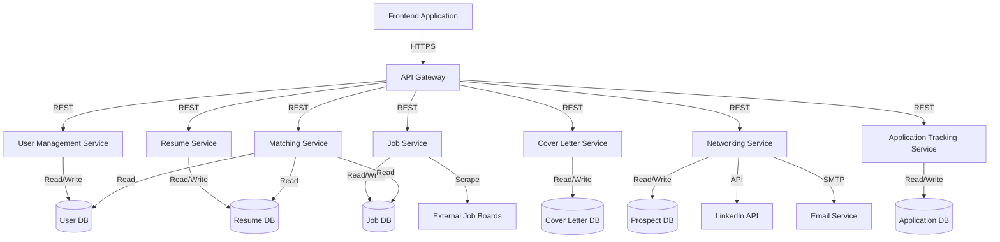

# Job Automator High-Level Design

## 1. System Architecture Overview

The Job Automator will be built using a microservices architecture to ensure modularity, scalability, and ease of development. The system will now consist of the following core components:

1. Frontend Application
2. API Gateway
3. Microservices
4. Databases
5. External Integrations

## 2. Component Descriptions

### 2.1 Frontend Application

- Single-page application (SPA) built with a modern framework (e.g., React)
- Responsive design for desktop and tablet devices
- Implements user interface for all core features

### 2.2 API Gateway

- Handles routing of requests to appropriate microservices
- Implements authentication and authorization
- Manages rate limiting and request/response transformation

### 2.3 Microservices

#### 2.3.1 User Management Service

- Handles user registration, login, and profile management
- Manages user preferences and settings

#### 2.3.2 Resume Service

- Parses and analyzes resumes
- Generates improvement suggestions
- Manages resume versions

#### 2.3.3 Job Service

- Aggregates job postings from various sources
- Provides search and filter functionality
- Manages job collections and company information

#### 2.3.4 Cover Letter Service

- Analyzes and scores cover letters
- Suggests templates and content improvements
- Manages cover letter versions

#### 2.3.5 Matching Service

- Compares resumes with job descriptions
- Generates relevance scores and rankings
- Provides personalized job recommendations

### 2.3.6 Networking Service

- Identifies potential prospects based on user preferences
- Generates personalized outreach messages
- Manages prospect data and interaction history

### 2.3.7 Application Tracking Service

- Manages job application data and status
- Provides CRUD operations for application entries
- Generates reminders and notifications

### 2.3.8 Ideal Candidate Resume Service

Stores and analyzes top candidate resumes
Provides comparison and benchmarking features
Generates trend reports on in-demand skills and qualifications

### 2.3.9 Reporting Service

- Aggregates data from other services
- Generates user and admin dashboards
- Produces detailed reports on job search activities and system performance

### 2.4 Databases

- Separate databases for each microservice to ensure data isolation
- Use of both SQL (e.g., PostgreSQL) and NoSQL (e.g., MongoDB) databases based on data structure and query requirements
- Prospect DB: Stores information about potential networking contacts
- Application DB: Stores job application data and status information

### 2.5 External Integrations

- Job board APIs for comprehensive job aggregation
- OAuth integration for social login (e.g., Google, LinkedIn)
- LinkedIn API for enhanced networking features
- Email service integration for sending outreach messages
- ATS integration APIs
- Webhook support for real-time data synchronization

## 3. Key Features and Workflows

### 3.1 User Registration and Profile Creation

1. User signs up via frontend application
2. API Gateway routes request to User Management Service
3. User Management Service creates user profile and stores in User DB
4. User is prompted to upload resume or create one using the application

### 3.2 Resume Upload and Analysis

1. User uploads resume through frontend
2. Resume Service parses the resume and extracts key information
3. Resume Service analyzes content and generates improvement suggestions
4. Results are stored in Resume DB and displayed to user

### 3.3 Job Search and Matching

1. Job Service continuously aggregates job postings from external sources
2. User initiates job search with specific criteria
3. Job Service returns matching job listings
4. Matching Service compares user's resume with job descriptions
5. Ranked job recommendations are presented to the user

### 3.4 Cover Letter Creation and Optimization

1. User selects a job to apply for
2. Cover Letter Service suggests appropriate templates based on job description
3. User creates or uploads a cover letter
4. Cover Letter Service analyzes content and provides improvement suggestions
5. Optimized cover letter is saved in Cover Letter DB

### 3.5 Networking and Outreach

- User sets preferences for networking targets
- Networking Service identifies potential prospects
- AI generates personalized outreach messages
- User reviews and sends messages through the platform
- Interaction history and outcomes are tracked

### 3.6 Application Tracking

- User inputs job application details
- Application Tracking Service stores data in Application DB
- User updates application status as needed
- Service generates reminders for follow-ups
- User views application progress through customizable dashboard

### 3.7 Multi-Role Resume Management

- User creates multiple versions of their resume
- Resume Service stores versions in Resume DB with appropriate tags
- When applying for a job, Matching Service suggests most relevant resume version
- User can compare and update resume versions as needed

### 3.8 Ideal Candidate Resume Analysis

- System continuously collects and anonymizes top candidate resumes
- User requests resume comparison
- Ideal Candidate Resume Service analyzes user's resume against top candidates
- System provides detailed comparison and improvement suggestions

### 3.9 Reporting and Analytics

- Reporting Service continuously aggregates data from other services
- User accesses personal dashboard for job search insights
- Admin accesses system dashboard for performance monitoring
- System generates periodic reports on job market trends and user success rates

## 4. Security Considerations

- Implement HTTPS for all client-server communications
- Use JWT (JSON Web Tokens) for authentication between services
- Encrypt sensitive data at rest in databases
- Implement rate limiting to prevent abuse
- Regular security audits and penetration testing
- Implement strict access controls for prospect and application data
- Ensure compliance with data protection regulations for storing prospect information

## 5. Scalability and Performance

- Use containerization (e.g., Docker) for easy deployment and scaling
- Implement caching mechanisms for frequently accessed data
- Use load balancers to distribute traffic across service instances
- Implement database sharding for handling large volumes of data
- Design Networking and Application Tracking services to handle large volumes of data
- Implement efficient search and filtering for application tracking

## 6. Monitoring and Logging

- Centralized logging system for all microservices
- Real-time monitoring of system health and performance
- Implement alerts for critical issues and anomalies
- Monitor usage patterns of new features to identify areas for improvement
- Track success rates of networking outreach efforts

## 7. Future Considerations

- Mobile application development
- Integration with Applicant Tracking Systems (ATS)
- Advanced AI features for personalized career coaching
- Expansion of job sources and supported languages
- Advanced AI for personalized career path recommendations
- Integration with more professional networking platforms
- Enhanced analytics for job search and application strategies

This high-level design provides a foundation for the Job Automator MVP, focusing on core features while allowing for future scalability and enhancements.
